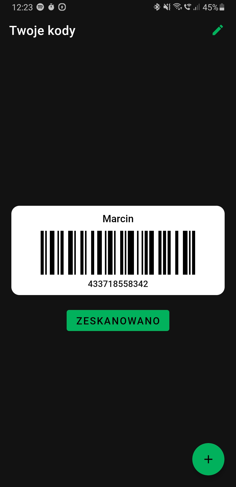
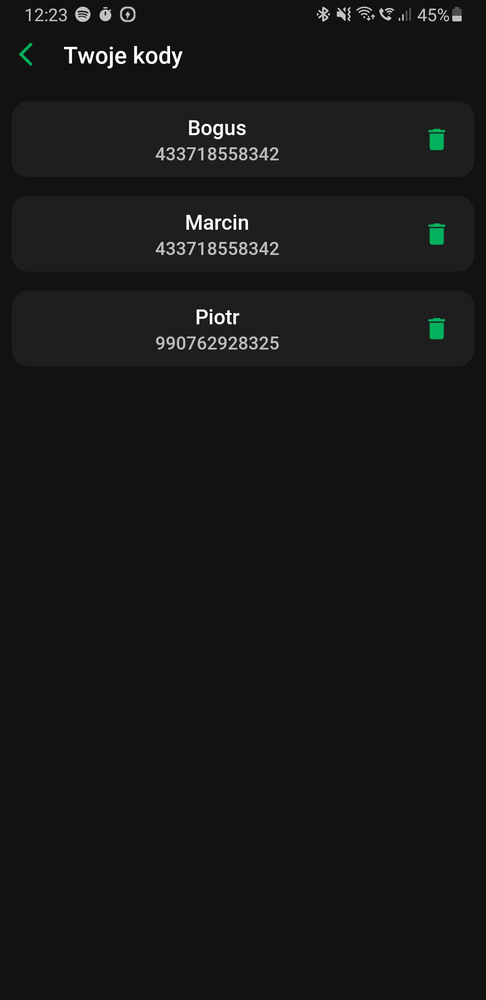
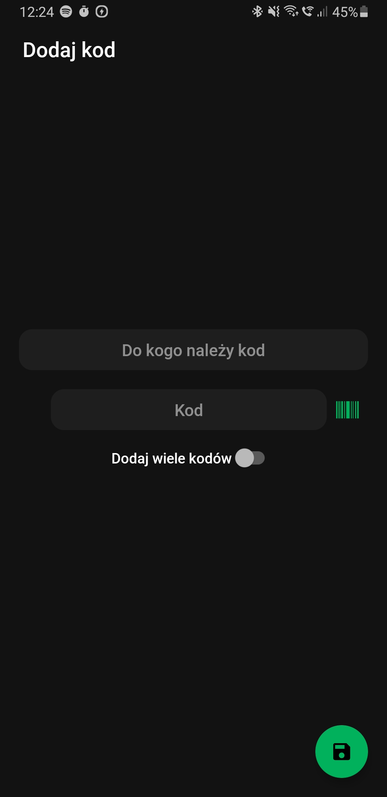

# CodeApp

## About

Project created for my loca "Żabka" store's owner. It allows the owner to enter and then use loyalty barcodes from "Żabka" application whenever a customer does not want to give their own loyalty code.

## Screenshots from the app

### Codes screen

### Editing and deleting codes

### Adding new code

## Technologies used

- Kotlin
- Coroutines
- Dagger Hilt
- ROOM

## Features planned for the future

- Ads
- Editing and deleting codes
- Sorting system

## Installation

You can clone this project to your Android Studio and then generate .apk file.
